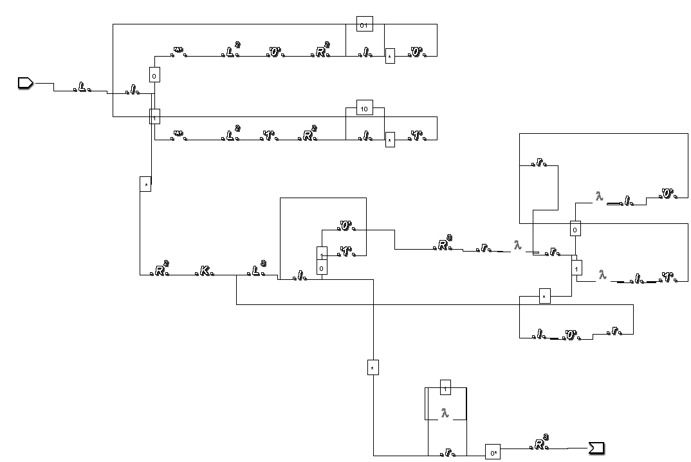

# Отчёт по лабораторной работе №6
---

## по курсу "Фундаментальная информатика"
---

Студент группы М8О-108Б-23 Нургалиев Даниэль Ильдарович

Работа выполнена 

Преподаватель: каф. 806 Севастьянов Виктор Сергеевич

1. **Тема**: Диаграммер Тьюринга
2. **Цель работы**: изучить диаграммер Тьюринга и выполнить задание
3. **Задание**: 
- Вычислить двоичный арифметический сдвиг сдвиг влево на число разрядов, равное первому
4. **Идея, метод, алгоритм решения задачи**: 
- скачать диаграммер Тьюринга
- опробовать "команды" диаграммера Тьюринга
- Вычислить двоичный арифметический сдвиг сдвиг влево на число разрядов, равное первому
5. **Сценарий выполнения работы**: выполнить команды, проверить тесты

|  Тест  | входные данные   | результат |
|:------:|:----------------:|:---------:|
| Тест 1 | 111 1            | 0         |
| Тест 2 | 10 111           | 100       |
| Тест 3 | 000 001          | 001       |

6. **Протокол**: 

7. Вывод: я начуился работать с диаграммами Тьюринга, менять символы, копировать числа, вычислять двоичный арифметический сдвиг влево на число разрядов, равное первому.